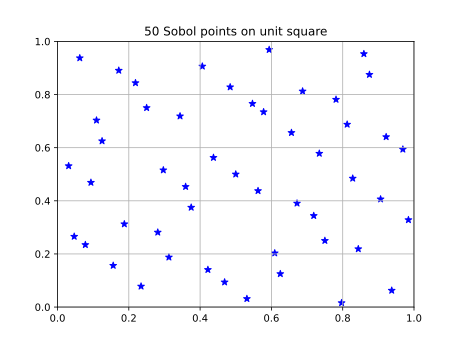

Sobol space coverage
====================

Example to show the space coverage of Sobol-points on a unit-square. 

Firstly we will create an simple Modelica model with two parameters like below::

   model SobolExample
    parameter Real a;
    parameter Real b;
   end SobolExample;

Save the SobolExample model to a file and upload it::

   from modelon.impact.client import Client

   client = Client(url=<impact-domain>) # url is optional; defaults to on-prem OR "https://impact.modelon.cloud"
   workspace = client.create_workspace(<workspace-name>)

   project = workspace.get_default_project()

   project.import_modelica_library('SobolExample.mo').wait()

Next, we will create an experiment with Sobol expansion and 2 modifiers that are uniformly 
distributed in [0, 1) as follows::

   from modelon.impact.client import Sobol, Uniform

   # Choose analysis type
   dynamic = workspace.get_custom_function('dynamic')

   # Get model
   model = workspace.get_model(<path to SobolExample model>)

   # Set-up experiment
   experiment_definition=experiment_definition.with_modifiers(
      {'a': Uniform(0, 1), 'b': Uniform(0, 1)}
      ).with_expansion(Sobol(50))

   exp = workspace.create_experiment(experiment_definition)

To extract Sobol points, we can execute the experiment by calling the the execute method on 
the experiment object with the with_cases argument set to an empty list.This generate all the cases 
for a given experiment definition and compiles all FMUs needed for running the cases. 

Note: No cases are executed when the execute method is called with an empty list argument.

   experiment_expand = exp.execute(with_cases=[]).wait()

Now we can extract the Sobol points like below::

   sobol_points = [list(case.input.parametrization.values()) for case in experiment_expand.get_cases()]

We can plot the points as shown below::

   import matplotlib.pylab as pl

   pl.figure()
   pl.title(f"{50} Sobol points on unit square")
   pl.scatter(*zip(*sobol_points), marker = '*', s = 48, color = 'blue')
   pl.grid()
   pl.xlim([0, 1])
   pl.ylim([0, 1])
   pl.show()

